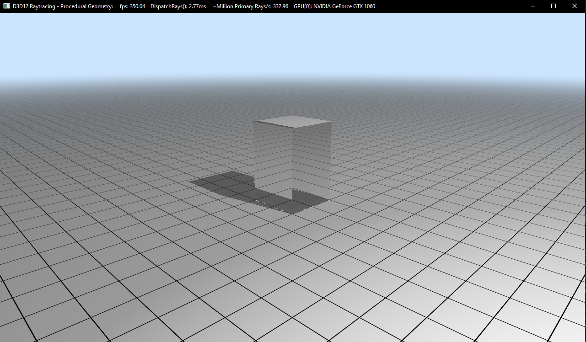

# RealTime-RayTracing-Caustics

Caustic is the term used to describe the patterns of light and color that occur when light rays are reflected or refracted from a surface.

This project implements two real-time ray tracing techniques for rendering caustic effects using DirectX RayTracing(DXR). The two techniques are based on an [NVIDIA research paper](https://link.springer.com/content/pdf/10.1007%2F978-1-4842-7185-8_30.pdf) from Xueqing Yang and Yaobin Ouyang. We are using base code from [Microsft's DXR samples](https://github.com/microsoft/DirectX-Graphics-Samples/tree/master/Samples/Desktop/D3D12Raytracing/src/D3D12RaytracingProceduralGeometry).

## Pitch
[Pitch Slides](https://docs.google.com/presentation/d/1REs8Hu2autTPQMAH6XG6zNYCJJKy6ZIw7h2XxpiPR0Q/edit#slide=id.p)

## Milestone 1
[Milestone1 Slides](https://docs.google.com/presentation/d/1B7V_mOnpXrHAl32jmDtPGyeIjG3wCJcU7zVgILual1E/edit?usp=sharing)

## Adaptive Anisotropic Photon Scattering (AAPS)

### Refraction & Reflection Box without Csaustics

## Adaptive Anisotropic Photon Scattering (RGWC)