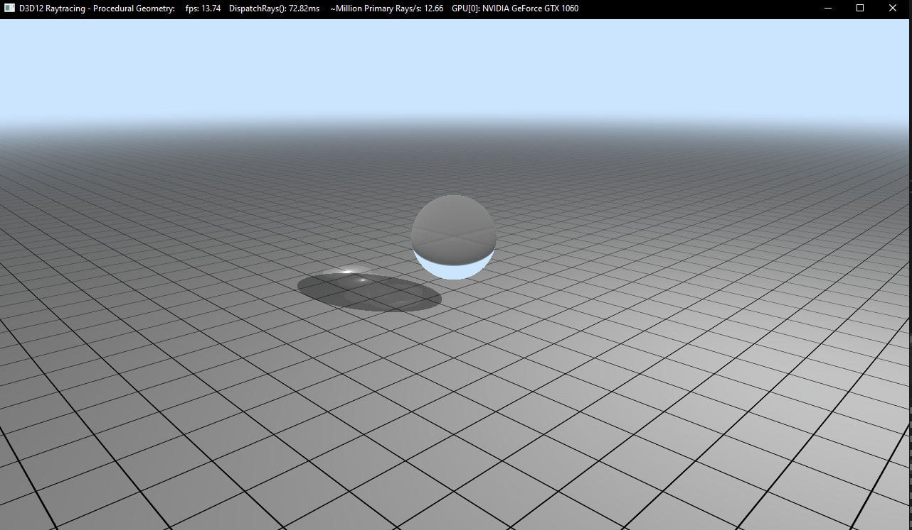

# RealTime-RayTracing-Caustics

## Overview

### Caustics
Caustic is the term used to describe the patterns of light and color that occur when light rays are reflected or refracted from a surface.

 

The above two images are the caustics from glass and water in real life.

### Project Implementation

This project implements real-time ray tracing techniques for rendering caustics effects using DirectX RayTracing(DXR). We are using base code from [Microsft's DXR samples](https://github.com/microsoft/DirectX-Graphics-Samples/tree/master/Samples/Desktop/D3D12Raytracing/src/D3D12RaytracingProceduralGeometry).

The main idea to visualize caustics is to use photon tracing. Several research paper are used to produce the final result. See [Reference](#reference).

### Requirement

## Presentation Slides
[Pitch Slides](https://docs.google.com/presentation/d/1REs8Hu2autTPQMAH6XG6zNYCJJKy6ZIw7h2XxpiPR0Q/edit#slide=id.p)

[Milestone1 Slides](https://docs.google.com/presentation/d/1B7V_mOnpXrHAl32jmDtPGyeIjG3wCJcU7zVgILual1E/edit?usp=sharing)

[Milestone2 Slides](https://docs.google.com/presentation/d/1bBe-m0S8USm9JjuZ0aMPiBgOyF8d1e4xpH3DJyMze_Q/edit?usp=sharing)

[Milestone3 Slides](https://docs.google.com/presentation/d/1QpMr9G-N3W1MqqeVK1NEGOBwIfzCrvPcZRigRFSnQKE/edit?usp=sharing)

## Photon Tracing

## 

## Caustics

### Refraction & Reflection Box without Caustics

## Reference

[Real-Time Raytraced Caustics](https://link.springer.com/content/pdf/10.1007%2F978-1-4842-7185-8_30.pdf)

[Microsft's DXR samples](https://github.com/microsoft/DirectX-Graphics-Samples/tree/master/Samples/Desktop/D3D12Raytracing/src/D3D12RaytracingProceduralGeometry)

[Photon Mapping](https://graphics.stanford.edu/courses/cs348b-00/course8.pdf)

[Photon Mapping GPU](https://cs.uwaterloo.ca/~thachisu/gpuppm_slides.pdf)