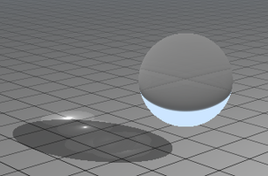
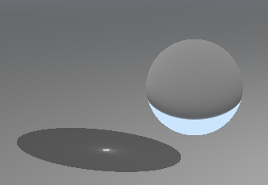
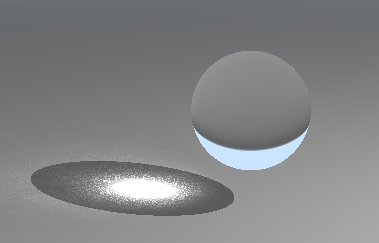

# RealTime-RayTracing-Caustics

## Overview

### Caustics
Caustic is the term used to describe the patterns of light and color that occur when light rays are reflected or refracted from a surface.

 

The above two images are the caustics from glass and water in real life.

### Cool Results

#### Live Demo

| Starbucks Coffee Cup | Chalice | 
|----|----|
|||

| Utah Teapot | Cat| 
|----|----|
| | |

#### Water

### Project Implementation

This project implements real-time ray tracing techniques for rendering caustics effects using [DirectX RayTracing(DXR)](#directx-raytracing(dxr)). The main idea to visualize caustics is to use photon tracing. Caustics are commonly seen in water, metallic, and transparent surfaces but they are either ignored or roughly handled such as decal textures. GPU ray tracing brings photon mapping which is currently most efficient algorithm to calculate caustics pattern. We used several research papers to guide us to produce the final result. See [References](#references).

### Requirement

* Windows 10
* Visual Studio 2019
* DirectX RayTracing(DXR)
* GeForce GTX 1060

## Presentation Slides
[Pitch Slides](https://docs.google.com/presentation/d/1REs8Hu2autTPQMAH6XG6zNYCJJKy6ZIw7h2XxpiPR0Q/edit?usp=sharing)

[Milestone1 Slides](https://docs.google.com/presentation/d/1B7V_mOnpXrHAl32jmDtPGyeIjG3wCJcU7zVgILual1E/edit?usp=sharing)

[Milestone2 Slides](https://docs.google.com/presentation/d/1bBe-m0S8USm9JjuZ0aMPiBgOyF8d1e4xpH3DJyMze_Q/edit?usp=sharing)

[Milestone3 Slides](https://docs.google.com/presentation/d/1QpMr9G-N3W1MqqeVK1NEGOBwIfzCrvPcZRigRFSnQKE/edit?usp=sharing)

## DirectX RayTracing

DirectX RayTracing (DXR) is a feature introduced in Microsoft's DirectX 12 API that implements ray tracing. We are using base code from [Microsft's DXR samples](https://github.com/microsoft/DirectX-Graphics-Samples/tree/master/Samples/Desktop/D3D12Raytracing/src/D3D12RaytracingProceduralGeometry).

## Photon Mapping

Photon mapping realistically simulates the interaction of light with different types of objects. We emit photons from the light and record its intersection and throughput to build the photon map. Then we use the normal ray tracing to accumulate photons near the hit position.

## Photon Caustics

Caustics photon map is slightly different from traditional photon map. For caustics, we only store photons that hit a diffuse object and its previous hit is a specular object. After that, we compute the caustics through ray tracing.

### Sphere
| Refraction Sphere| Refraction Sphere with caustics |
|----|----|
|  | |

### Cube

The first image is a glass cube with pure refraction. The second image is the same glass cube with caustics map visualized. Next is the caustic radiance estimation result via naïve k nearest neighbor search, which includes 3 nearest photons. Next two images are the results using photon spatial hashing and nearby estimation. We can see the results are pretty close to real-life cube caustics shown in the last reference image.

| Refraction Cube| Refraction Cube with Photon Visualization| 
|----|----|
| | |

| Naive k nearest neightbor| Spatial Hashing 1| 
|----|----|
| | |

| Spatial Hashing 2| Real Life Reference image | 
|----|----|
| | |

## Naive Search

They are several algorithms to accumulate caustic photons near the hit position. The first one is the naive search which accumulates all the photons within a predefined search radius. This algorithm is easy to implement but it has several drawbacks. First of all, it produces an unnatural visual effect. As we can see from the below image, there are artificial circles surrounding the caustics. This may be caused by the predefined search radius. Another disadvantage is that this algorithm is not very efficient. Since it traverses all the photons to find nearby ones at each hit position, the time complexity is O(N), where N is the number of photons we emit.

### Naive Caustics

## Stochastic Spatial Hashing

Another algorithm we implemented is the stochastic hash where we store photons in a hash table. In this algorithm, we separate 3D space into small cells. Each cell. For each photon's position, we compute the cell it belongs to and hash it into the hash table. If there is more than one photon's at the same index, we just accumulate the photon count. Then we search for neighbors to compute final caustics at each hit position. This method increases variance since it ignores a lot of photons. This also introduces some noise to the final image. However, the results looks more natural, as we can see from the below image. This algorithm is also a lot more efficient than naive search. The time complexity is O(1) since we only need to find its neighbor.

### Stochastic Spatial Hashing Caustics

## Performance Analysis

All the performance test is run by GeForce GTX 1060. It will be much faster if use advance graphics cards such as GeForce RTX 3060 and above.

Note that the fps for sphere without caustics is about 300fps.

### Naive Search

The number of photons will affect both fps and the visual effect in naive search. We can see both performance is unsatisfactory from the below images.

| 2^12 photons(15 fps) | 2^12 photons(11 fps) |2^12 photons(8 fps) |
|---|---|---|
| |  |  |

### Spatial Hashing

#### Number of Photons

Like naive search, the number of photons will also affect both fps and the visual effect in sptial hashing though it is a lot faster with more photons. As number of photon increase, the caustics area increases. 

| 2^18 photons (37 fps) | 2^22 photons (25 fps) |2^24 photons (20 fps) |
|---|---|---|
| |  |  |

Note that the cell size is 0.02^3 for above images.

#### Cell Size

As spatial grid's cell size increases, the caustics area increases and the fps also increases. Since grid size is fixed, increase of cell size means decrease the number of cells in the grid. Thus the fps increases.

| 0.02^3 cell size(20 fps)| 0.1^3 cell size (42 fps)|0.1^3 cell size (84 fps) |
|----|----|----|
| | | |

Note that the photon number is 2^24 for above images.

## Future Work
* GPU KD Tree nearest neighbor search, spatial hashing is a good estimation but not detailed enough
* Support more model import, including mtl, gltf. Make the DXR pipeline more efficient with large models
* Raytracing and photon tracing with more bounces and indirect light to improve overall quality

## References

[Real-Time Raytraced Caustics](https://link.springer.com/content/pdf/10.1007%2F978-1-4842-7185-8_30.pdf)

[Microsft's DXR samples](https://github.com/microsoft/DirectX-Graphics-Samples/tree/master/Samples/Desktop/D3D12Raytracing/src/D3D12RaytracingProceduralGeometry)

[Photon Mapping](https://graphics.stanford.edu/courses/cs348b-00/course8.pdf)

[Photon Mapping GPU](https://cs.uwaterloo.ca/~thachisu/gpuppm_slides.pdf)

[Progressive Photon Mapping on GPUs](https://apartridge.github.io/OppositeRenderer/master/masteroppgave.pdf)
